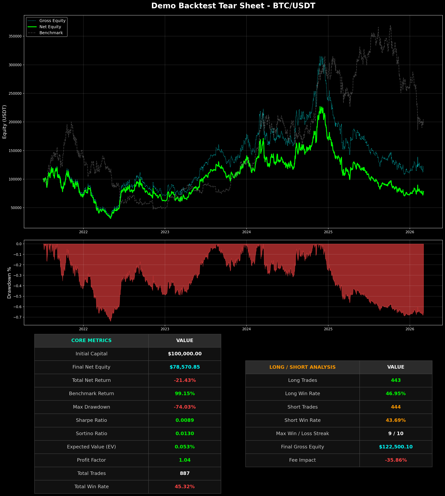

# Vectorized Backtest Infrastructure Demo

This repository contains a demonstration of a structural Python backtesting engine built for performance and reporting clarity. 

## 🛠️ Tech Stack & Features
* **Data Processing:** `Polars` (for memory-efficient, vectorized computation)
* **Precision Handling:** `Decimal` (for financial-grade balance calculation)
* **Visualization:** `Matplotlib` (custom grid-spec tear sheet generation)

## ⚠️ Disclaimer (Toy Factor Only)
To protect proprietary Intellectual Property (IP), the alpha factor implemented in `demo_backtest.py` is strictly a **toy momentum factor** (normalized daily candle body). 

It does **NOT** contain any of my actual live-trading machine learning models (e.g., LGBM cross-sectional factors), proprietary feature engineering, or strict risk-management / stop-loss logic. This code is purely to demonstrate data engineering, vectorization, and OOP reporting capabilities.

## 📊 Sample Output

